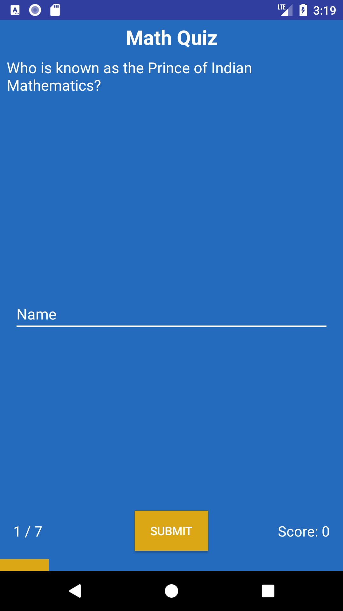
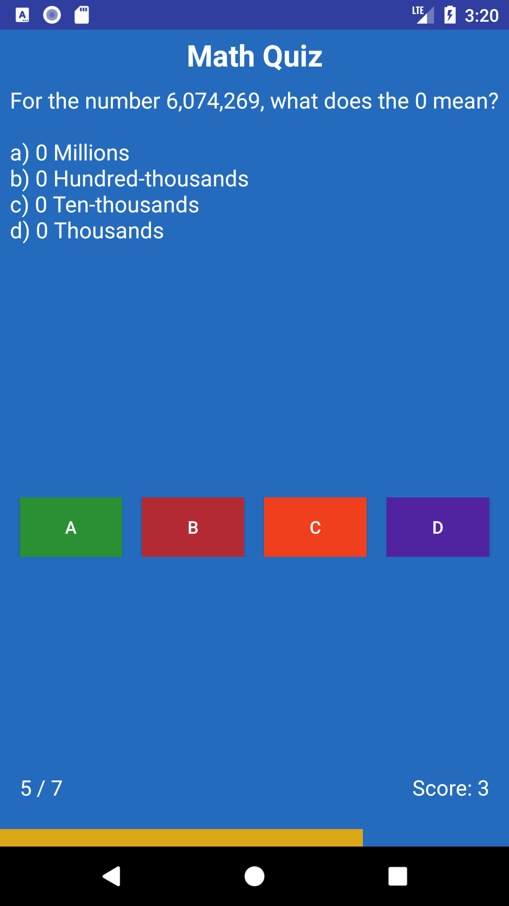

Quiz app for Android Basics Nanodegree

# Quizzed

* It's a simple math quiz app, design for children in 5th and 6th Grade to practice their math skills.
* _**Designed for API 15 or better**_
* Built in Android Studio.

## Screenshots

